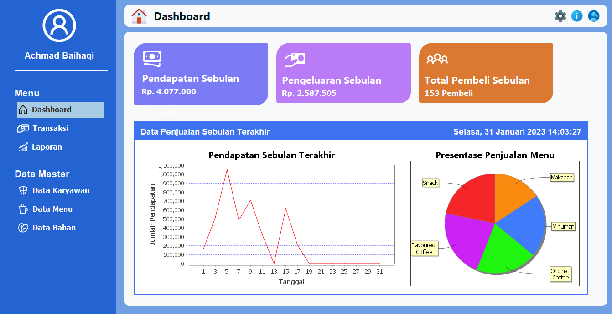
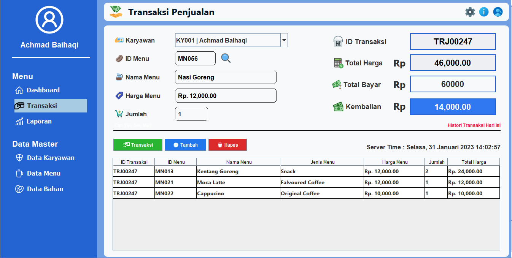
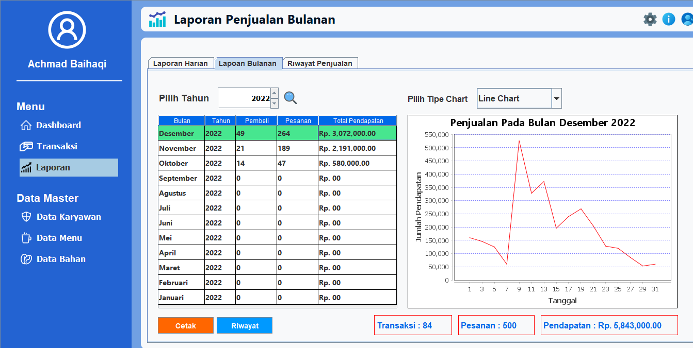

<h1 align="center">Kopi Paste</h1>

 

  

 

<!-- Project Shields -->

  [![Repo Size][repo-shield]][repo-url]
  [![License][license-shield]][license-url]
  [![Last Commit][commit-shield]][commit-url]

  [repo-shield]: https://img.shields.io/github/repo-size/haqiachd/kopi-paste.svg?style=for-the-badge
  [repo-url]: https://img.shields.io/github/repo-size/haqiachd/kopi-paste.svg
  [commit-shield]: https://img.shields.io/github/last-commit/haqiachd/kopi-paste.svg?style=for-the-badge
  [commit-url]: https://img.shields.io/github/last-commit/haqiachd/kopi-paste.svg
  [license-shield]: https://img.shields.io/github/license/haqiachd/kopi-paste.svg?style=for-the-badge
  [license-url]: https://github.com/haqiachd/kopi-paste/blob/main/LICENSE.md

<!-- Table of Contents -->

  
Table of Contents

  <ol>
    <li><a href="#deskripsi-project">Deskripsi Project</a></li>
    <li>
      <a href="#fitur-aplikasi">Fitur Aplikasi</a>
      <ul>
        <li><a href="#data-master">Dashboard</a></li>
        <li><a href="#transaksi">Transaksi</a></li>
        <li><a href=#laporan>Laporan</a></li>        
        <li><a href=#backup-database>Backup Database</a></li>
      </ul>
    </li>
    <li>
    <a href="#contoh-tampilan-aplikasi">Contoh Tampilan Aplikasi</a>
      <ul>
        <li><a href="#dashboard">Dashboard</a></li>
        <li><a href="#menu-transaksi-jual">Menu Transaksi Jual</a></li>
        <li><a href="#menu-laporan-jual">Menu Laporan Jual</a></li>
      </ul>
    </li>
    <li><a href="#cara-instalasi-aplikasi">Cara Instalasi Aplikasi</a>
    <li><a href="#default-akun">Default Akun</a>
    <li><a href="#persyaratan-sistem-minimal">Persyaratan Sistem Minimal</a></li>
    <li><a href="#contributor">Contributor</a></li>
    <li><a href="#catatan">Catatan</a></li>
  </ol>

## Deskripsi Project
Kopi Paste adalah sebuah aplikasi yang dibuat oleh Cito Team TIF 3 PSDKU Polije. Tujuan aplikasi ini dibuat adalah untuk memudahkan dalam melakukan transaksi penjualan atau pembelian pada UMKM dan menyajikan laporan penjualan atau pembelian dari transaksi sehingga pemilik UMKM dapat memantau perkembangan UMKM mereka.

## Fitur Aplikasi

### Data Master
Adalah sebuah fitur yang menampilkan data-data dari UMKM seperti data karyawan, data menu dan data bahan. Pengguna dengan level admin dapat menambahkan, mengedit dan menghapus data dari data master yang tersedia pada aplikasi ini.
### Transaksi
Terdapat dua pilihan transaksi antara lain transaksi penjualan dan transaksi pembelian. Fitur transaksi pada aplikasi ini dirancang agar mudah dipahami/digunakan bagi pengguna. Pengguna dengan level admin maupun karyawan dapat mengakses fitur transaksi ini.
### Laporan
Terdapat dua pilihan laporan antara lain laporan penjualan dan laporan pembelian. Fitur laporan ini menampilkan riwayat dari transaksi penjualan atau pembelian yang telah dilakukan. Fitur laporan terbagi menjadi 3 bagian antara lain laporan harian, laporan bulanan dan riwayat penjualan / pembelian. Pada fitur laporan juga terdapat grafik yang menampilkan data dari penjualan / pembelian sehingga pemilik UMKM dapat memantau perkembangan bisnis mereka. Fitur laporan ini hanya dapat diakses oleh pengguna dengan level Admin saja.
### Backup Database
Fitur ini digunakan untuk membackup database dari aplikasi jika suatu waktu aplikasi / database mengalami kerusakan sehingga mencegah pemilik UMKM untuk kehilangan data-data mereka. Fitur ini hanya dapat diakses oleh pengguna dengan level Admin saja. 

## Contoh Tampilan Aplikasi
### Dashboard

### Menu Transaksi Jual

### Menu Laporan Jual

## Cara Instalasi Aplikasi
- Pastikan Anda sudah menginstal Java dan MySQL.
- Download file installer aplikasi <a href="https://drive.google.com/drive/folders/1B2qoN3xB2I40fEJZWHSsO_hex6QwWbMx">disini</a>.
- Jika sudah didownload double clik pada aplikasi untuk menginstall.
- Jika sudah terinstall buka MySQL Anda.
- Kemudian import file database 'kopi_paste_business.sql' yang berada pada folder <a href="https://github.com/haqiachd/kopi-paste/tree/main/db">db</a>.
- Buka kembali aplikasi 'Kopi Paste'
- Login dengan default akun.
- Selesai.

## Default Akun
* Akun Admin 
  - username : admin  
  - password : 0987654321
* Akun Siswa  
  - username : ky01  
  - password : 1234567890

## Persyaratan Sistem Minimal
- Java 8
- 2 GB RAM
- 1360 x 768 screen resolution

## Contributor
- Achmad Baihaqi
- Mohammad Ilham Islamy
- Septian Yoga Pamungkas
- Widyasari Raisya Salsabilla

## Catatan
Aplikasi Kopi Paste dirancang untuk mudah dipahami dan mudah digunakan sehingga bagi yang awam tentang teknologi tidak merasa kesulitan saat menggunakan aplikasi ini. Diharapkan dengan dibuatnya aplikasi ini dapat membantu pemilik UMKM untuk mengelola bisnis mereka sehingga mereka dapat menentukan langkah  bisnis mereka di masa mendatang. Aplikasi ini merupakan project open source Anda dapat menggunakanya secara gratis. Jika ada hal yang kurang jelas atau ada hal yang ingin ditanyakan silahkan [hubungi saya](https://api.whatsapp.com/send/?phone=6285655864624).

(<a href="#top">back to top</a>)

